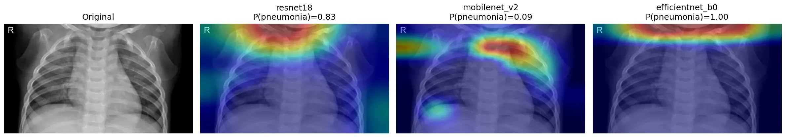
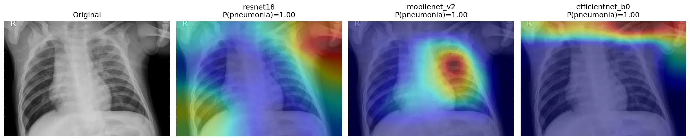

# 🩺 Chest X-Ray Pneumonia Screening — CNN Comparison Demo

> **Comparative Deep Learning Analysis & Interpretability Trade-Off Study**
>
> *A medical-research screening demonstration trained on the Kermany et al. Chest X-Ray Images (Pneumonia) dataset.*

---

## 📊 Research Summary & Core Findings

This project evaluates three Convolutional Neural Network (CNN) architectures (**ResNet18**, **MobileNetV2**, **EfficientNet-B0**) trained via transfer learning to classify chest X-ray scans as **NORMAL** or **PNEUMONIA**.

### The Accuracy-vs-Interpretability Trade-off

The core finding of this research highlights a critical clinical dilemma: **the highest accuracy model is not necessarily the most trustworthy.**

*   **ResNet18** achieved the highest raw classification accuracy (**87.8%**). However, **Grad-CAM explainability analysis** revealed that it frequently focused on **non-diagnostic regions** (such as the shoulder joint structure, patient posture, and collarbone) to make its decisions.
*   **MobileNetV2** achieved a slightly lower accuracy (**85.6%**) but consistently localized its convolutional attention on the **actual lung tissue and pulmonary parenchyma**, aligning with standard radiological diagnostic criteria.

This demonstrates that lower-accuracy models can sometimes be more clinically robust, explainable, and safe for diagnostic deployment.

---

## ⚡ Model Performance Comparison

| Architecture | Accuracy | F1 | AUC-ROC | Sensitivity | Specificity | Grad-CAM focus |
| :--- | :---: | :---: | :---: | :---: | :---: | :--- |
| **ResNet18** (served) | **87.8%** | **0.911** | **0.978** | 0.997 | 0.679 | ⚠️ Shoulders / clavicles |
| **MobileNetV2** | 85.6% | 0.896 | 0.968 | 0.995 | 0.624 | ✅ Lung fields |
| **EfficientNet-B0** | 84.8% | 0.891 | 0.951 | 0.997 | 0.598 | 🔍 Diffuse / image border |

Test split of Kermany et al. (n = 624: 234 normal, 390 pneumonia), threshold 0.5. Reproduced from the exported ONNX models through the API's own preprocessing with [`scripts/export_onnx.py`](scripts/export_onnx.py). Training: [`notebooks/chest-x-ray.ipynb`](notebooks/chest-x-ray.ipynb).

All three models over-call pneumonia: near-perfect sensitivity, but a third of healthy scans are flagged. That follows from the 3:1 class imbalance and a 16-image validation split.

---

## 🔍 Visualizing Diagnostic Focus: Grad-CAM



*Normal X-ray: ResNet18 predicts pneumonia (P = 0.83) while attending to the neck and clavicles; MobileNetV2 correctly predicts normal (P = 0.09).*



*   **Pneumonia Specimen**: Heatmaps concentrate on the lower lobe consolidation regions.
*   **Normal Specimen**: Heatmaps remain diffuse, indicating unremarkable, healthy air-filled lung fields.

---

## 🛠️ Tech Stack & Micro-Architecture

To run efficiently in resource-constrained cloud environments (serverless functions on Vercel), this application is designed without heavy deep learning frameworks:

*   **Backend**: **FastAPI** + **Uvicorn** for a high-performance, asynchronous web API.
*   **Inference Engine**: **ONNX Runtime** (CPU Provider), running predictions with a minimal memory footprint.
*   **Image Processing**: Pure **NumPy** & **Pillow** implementing the identical pipeline used during training:
    1. Grayscale conversion.
    2. Dimension replication to 3 channels (RGB format).
    3. Bilinear resizing to $224 \times 224$ pixels.
    4. ImageNet normalization: $\text{mean} = [0.485, 0.456, 0.406]$ and $\text{std} = [0.229, 0.224, 0.225]$.
*   **Frontend**: Professional clinical-grade single-page application built using semantic **HTML5**, custom **Vanilla CSS**, and **Vanilla Javascript**. Contains:
    *   Drag-and-drop upload, downscaled in the browser to stay under Vercel's 4.5 MB request limit.
    *   Probability meter with illustrative screening thresholds.
    *   Light and dark themes, responsive down to 360px.

---

## 🚀 Deployment (Vercel)

Live: **https://pneumoscan-nine.vercel.app**

Vercel's FastAPI preset serves `main.py` as a Python function; `public/` is served from the CDN. `vercel.json` pins the framework (otherwise `render.yaml` gets detected as a service), and `.vercelignore` keeps the bundle small.

```bash
npx vercel deploy --prod
```

---

## 💻 Local Setup Instructions

### 1. Model
The trained ResNet18 ships as `backend/model.onnx` (45 MB). To re-export from a PyTorch checkpoint:
```bash
python scripts/export_onnx.py resnet18_best.pth --test-dir chest_xray/test
```

### 2. Set Up Virtual Environment & Dependencies
```bash
# Create environment
python -m venv venv

# Activate environment (Windows)
venv\Scripts\activate

# Activate environment (Mac/Linux)
source venv/bin/activate

# Install dependencies
pip install -r requirements.txt
```

### 3. Launch the Server
```bash
uvicorn main:app --host 127.0.0.1 --port 8000 --reload
```
Visit [http://127.0.0.1:8000](http://127.0.0.1:8000) in your browser.

### 4. End-to-end test (Playwright)
```bash
pip install playwright pytest && playwright install chromium
pytest tests                                            # against localhost:8000
BASE_URL=https://pneumoscan-nine.vercel.app pytest tests  # against production
```

---

## ⚖️ Clinical Disclaimer
**This application is a student research demonstration for educational purposes only. It is NOT an FDA-cleared diagnostic tool and should never be used to make clinical decisions or assessments. Consult a licensed radiologist or medical professional for health evaluations.**
